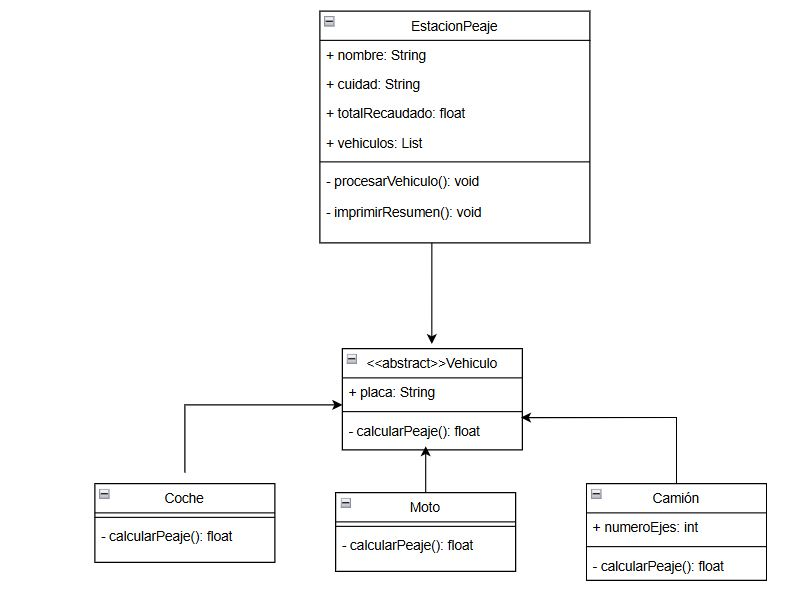

# Sistema de Peaje

## Descripción
Este proyecto implementa un sistema de peaje que permite gestionar el cobro de tarifas a diferentes tipos de vehículos en una estación de peaje. El sistema calcula el valor del peaje para cada vehículo que llega y mantiene un registro del total recaudado.

## Características
- Registro de vehículos (coches, motos y camiones) que pasan por el peaje.
- Cálculo automático de tarifas según el tipo de vehículo.
- Seguimiento del total recaudado en la estación de peaje.
- Generación de informes con el listado de vehículos y el total acumulado.

## Estructura del Proyecto
El proyecto está estructurado en las siguientes clases principales:

1. `EstacionPeaje`: Representa la estación de peaje.
2. `Vehiculo`: Clase abstracta que representa un vehículo genérico.
3. `Coche`: Representa un coche.
4. `Moto`: Representa una moto.
5. `Camion`: Representa un camión.

## Diagrama UML

## Tecnologías Utilizadas

- Java 17 
- Maven
- JUnit y Hamcrest para pruebas.
